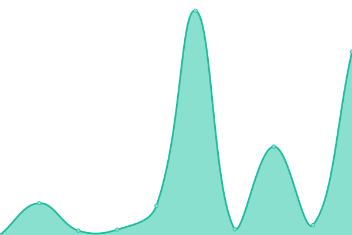
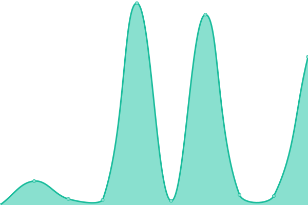

# [📈 Live Status](https://julioromero.github.io/upptime): <!--live status--> **🟧 Partial outage**

This repository contains the open-source uptime monitor and status page for [julioromero](https://julioromero.github.io/upptime), powered by [Upptime](https://github.com/upptime/upptime).

With [Upptime](https://upptime.js.org), you can get your own unlimited and free uptime monitor and status page, powered entirely by a GitHub repository. We use [Issues](https://github.com/julioromero/upptime/issues) as incident reports, [Actions](https://github.com/julioromero/upptime/actions) as uptime monitors, and [Pages](https://julioromero.github.io/upptime) for the status page.

<!--start: status pages-->
<!-- This summary is generated by Upptime (https://github.com/upptime/upptime) -->
<!-- Do not edit this manually, your changes will be overwritten -->
<!-- prettier-ignore -->
| URL | Status | History | Response Time | Uptime |
| --- | ------ | ------- | ------------- | ------ |
|  [Bitwarden](https://bitwarden.mustard-leaf.duckdns.org/) | 🟥 Down | [bitwarden.yml](https://github.com/julioromero/upptime/commits/HEAD/history/bitwarden.yml) | 

 2437ms
     
 | 

<a href="https://julioromero.github.io/upptime/history/bitwarden">100.00%</a>
    

|  [HAOS](https://haos.mustard-leaf.duckdns.org/) | 🟩 Up | [haos.yml](https://github.com/julioromero/upptime/commits/HEAD/history/haos.yml) | 

 3499ms
     
 | 

<a href="https://julioromero.github.io/upptime/history/haos">99.75%</a>
    

|  [Mealie](https://mealie.mustard-leaf.duckdns.org/) | 🟩 Up | [mealie.yml](https://github.com/julioromero/upptime/commits/HEAD/history/mealie.yml) | 

 4109ms
     
 | 

<a href="https://julioromero.github.io/upptime/history/mealie">99.67%</a>
    

|  [OCI APEX Instance](https://gabd18c80086d52-mustardleaf.adb.us-ashburn-1.oraclecloudapps.com/) | 🟩 Up | [oci-apex-instance.yml](https://github.com/julioromero/upptime/commits/HEAD/history/oci-apex-instance.yml) | 

 528ms
     
 | 

<a href="https://julioromero.github.io/upptime/history/oci-apex-instance">100.00%</a>
    

<!--end: status pages-->

[**Visit our status website →**](https://julioromero.github.io/upptime)

## 📄 License

- Powered by: [Upptime](https://github.com/upptime/upptime)
- Code: [MIT](./LICENSE) © [Anand Chowdhary](https://anandchowdhary.com), supported by [Pabio](https://pabio.com)
- Data in the `./history` directory: [Open Database License](https://opendatacommons.org/licenses/odbl/1-0/)
